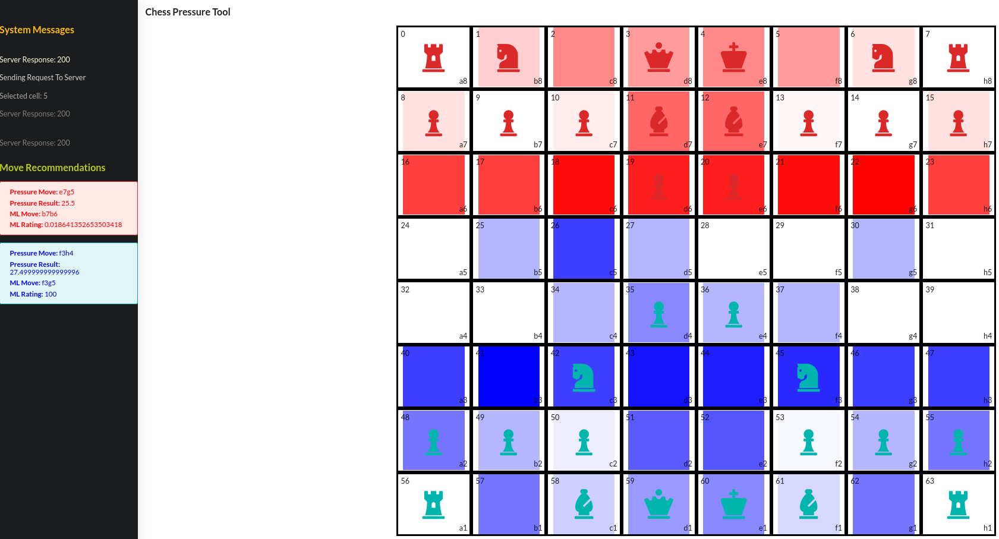

## Getting Started:
The following subsections contain instructions to install the app on a local machine and start the application.

### Pull The Repository
Use __git clone https://github.com/Maple-Lazuli/pressure-chess.git__ in the terminal 
to make a copy on the local machine or navigate to the repository directly on github [here](https://github.com/Maple-Lazuli/pressure-chess.git) 
and download the project as an archive.

### Create The Virtual Environment For Python
In the root of the project directory, execute one of the following command sequences based on the OS in use:
1. __Linux/macOS:__
   
   a. _python3 -m pip install --user virtualenv_

   b. python3 -m venv env

2. __Windows:__
   
   a. _py -m pip install --user virtualenv_

   b. py -m venv env
   
### Install The Python Requirements
Execute __pip install -r requirements.txt__ in the terminal from the root project directory to have pip


### Setup NodeJS and ReactJS
Start by ensuring __nodeJS__ is installed. Once __nodeJS__ is installed, clone this repo to your machine then run the following 
command to install the packages from the root directory of the project.
```
npm install
```

### Start The App 
#### Starting The Python Backend (part 1)
From the root directory of the project, execute
```
python backend/app.py
```
#### Starting The Node Frontend (part 2)
From the root directory of the project, execute
```
npm start
```

## Using The App
After the app starts, it will host a webserver on the local machine that is reached at [http://localhost:3000](http://localhost:3000/)

Use the app by clicking a piece then clicking where that piece should be moved to. When doing this, the front end will
send the data to backend to perform some calculations. These calculations will be returned in the form of move recommendations
and pressure visualizations for the users.



The server messages tell you what the application is doing and the recommendations tell you which moves will maximize 
pressures and which moves are categorized as the best by the machine learning model.

## Acknowledgements
The following sources were crucial to the development of this project

1. __Chess__ - The Chess package was used to help create permutations of moves available to the players.
2. __scikit-learn__ - scikit-learn was used for the processing portions of this project.
3. __Tensorflow__ - Keras and Tensorflow were used to create, compile, and fit the model.
4. __Flask__ - Flask was used to get the classifications and matrices to the NodeJS app for displaying to the user.
5. __Numpy__ - Numpy was used for numerical computations in the extraction and transformation portion of this project
6. __Pandas__ - Pandas was used for data analysis in the exploratory, extraction, and transformation portions of this project.
7. __ReactJS__ - ReactJS was used to build the interface and manage the interactive elements of the page.
8. __Stockfish__ - Stockfish was used to assess the effectiveness of moves.
